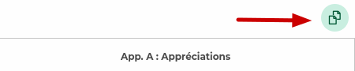

# 🎓 BGRAPP Pyconseil

[](https://www.python.org/downloads/)
[](LICENSE)
[](README_CONFIG_IA.md)

**Outil d'aide à la préparation des conseils de classe en collège**

Une application Python avec interface graphique pour centraliser et traiter les données des élèves, optimisant ainsi la préparation des conseils de classe dans les établissements de collège.

## ✨ Fonctionnalités

### 🔄 Traitement des données
- **Import automatique** : Traitement des fichiers Excel (liste élèves) et CSV (notes par matière)
- **Un JSON par période** : Chaque période (S1/S2 ou T1/T2/T3) est sauvegardée dans son propre fichier (ex. `output_T3.json`), ne contenant que cette période
- **Périodes liées** : Les autres périodes sont référencées via des liens (auto-découverte des JSON du même dossier + ajout/retrait manuel) et fusionnées en lecture seule pour la vue d'ensemble
- **Vérification de cohérence** : Correspondance automatique entre nombre d'élèves et bulletins générés
- **Détection automatique de la période** : Analyse des colonnes Pronote (et du nom du dossier) pour distinguer S1/S2/T1/T2/T3 et adapter tout le pipeline

### 🤖 Intelligence artificielle OpenAI
- **Provider unique** : Intégration centrée OpenAI (Responses API)
- **Traitement intelligent** : Amélioration automatique des appréciations avec balises HTML sémantiques
- **Génération synthétique** : Création d'appréciations générales à partir des notes de chaque matière
- **Balises contextuelles** : Identification automatique des éléments positifs et négatifs
- **Configuration intégrée** : Gestion clé API + modèle OpenAI → [Guide Configuration IA](README_CONFIG_IA.md)

### 🖥️ Interface graphique
- **Fenêtre principale** : Sélection du dossier de travail et lancement des traitements
- **Fenêtre d'édition** : Visualisation et édition de la **période courante** ; les périodes liées apparaissent en lecture seule
- **Fenêtre conseil** : Vue d'ensemble multi-périodes (synthèse, évolution) reconstruite à partir des périodes liées
- **Bouton « 🔗 Périodes liées »** : Présent dans les trois fenêtres pour gérer les JSON des autres périodes
- Les fenêtres d'édition/conseil s'adaptent automatiquement à la période et aux périodes liées présentes (colonnes Moy./Abs./Ret. et évolution dynamiques)

## 🚀 Installation

### 📦 Téléchargement des exécutables (Recommandé)

Pour utiliser l'application sans installer Python, téléchargez directement les exécutables depuis les [dernières releases GitHub](https://github.com/Entonox13/BGRAPP_pyconseil-public/releases/latest) :

- **Linux** : AppImage portable (`.AppImage`) ou exécutable Linux
- **Windows** : Exécutable portable (`.exe`)

[](https://github.com/Entonox13/BGRAPP_pyconseil-public/releases/latest)
[](https://github.com/Entonox13/BGRAPP_pyconseil-public/releases)

**🔗 Lien direct** : [Télécharger la dernière release](https://github.com/Entonox13/BGRAPP_pyconseil-public/releases/latest)

> 💡 **Note** : Les exécutables sont automatiquement créés par GitHub Actions à chaque commit. Les releases officielles sont créées lors de la création de tags (ex: `v1.0.0`).

### Installation depuis les sources

### Prérequis
- Python 3.8 ou supérieur
- Environnement Conda recommandé

### Installation des dépendances
```bash
# Cloner le repository
git clone https://github.com/Entonox13/BGRAPP_pyconseil-public.git
cd BGRAPP_pyconseil-public

# Installer les dépendances
pip install -r requirements.txt

# Configurer les variables d'environnement pour l'IA
cp env.example .env
# Éditer .env avec vos clés API (voir guide de configuration)
```

### ⚡ Configuration IA OpenAI

L'application dispose d'une **interface de configuration intégrée** pour OpenAI :

1. **Lancer l'application** : `python main.py`
2. **Cliquer sur "🤖 Configuration IA"** dans la fenêtre principale
3. **Renseigner la clé API OpenAI** et sélectionner le modèle
4. **Sauvegarder** la configuration

**📖 Guide complet** : [README_CONFIG_IA.md](README_CONFIG_IA.md)

#### Configuration manuelle (optionnel)
Vous pouvez également créer un fichier `.env` manuellement :
```env
# Provider (OpenAI uniquement)
AI_ENABLED_PROVIDER=openai

# Clé API OpenAI
OPENAI_API_KEY=sk-votre-clé-openai

# Modèle OpenAI (optionnel, valeur par défaut sinon)
OPENAI_MODEL=gpt-5-mini
```
💡 Gagnez du temps en copiant `env.example` vers `.env` puis en complétant vos clés.

### 📦 Standard d'appels OpenAI
- Les appels IA passent par **OpenAI Responses API**.
- Le modèle par défaut est `gpt-5-mini`.
- Les modèles OpenAI restent configurables depuis l'interface.
- Consultez `README_CONFIG_IA.md` pour les détails de configuration.

### 🔒 Protection RGPD intégrée

**L'application intègre un système d'anonymisation automatique conforme RGPD** :

- **Anonymisation transparente** : Les noms et prénoms des élèves sont automatiquement remplacés par "John DOE" avant envoi aux APIs IA
- **OpenAI** : Protection RGPD active sur tous les appels IA
- **Désanonymisation automatique** : Les réponses des APIs sont automatiquement restaurées avec les vrais noms des élèves  
- **Aucun impact utilisateur** : Le processus est totalement transparent
- **Activation par défaut** : La protection RGPD est activée automatiquement
- **Conformité réglementaire** : Respect des articles 4(5), 5(1)(c) et 32 du RGPD
- **Repository sécurisé** : Aucun fichier contenant de vraies données personnelles d'élèves n'est versionné

```python
# La protection RGPD est activée par défaut (OpenAI)
service = get_ai_service()  # enable_rgpd=True

# Pour désactiver (déconseillé) :
service = get_ai_service(enable_rgpd=False)
```

**⚠️ IMPORTANT** : Ce repository ne contient aucune donnée personnelle réelle. Pour utiliser l'application avec vos propres données :
1. Créez un dossier privé (non versionné) avec vos fichiers Excel/CSV
2. Utilisez l'interface pour sélectionner ce dossier
3. L'anonymisation RGPD protégera automatiquement vos données

Consultez `exemples/README_DONNEES_ANONYMISEES.md` pour les détails complets.

## 📖 Utilisation

### Lancement de l'application
```bash
python main.py
```

### Structure des fichiers d'entrée
Votre dossier de travail doit contenir : un fichier .csv par matière (nommé selon la matière); un fichier source.xlsx contenant les noms les appréciations du semestre précédent(il est préférable de travailler à partir du fichier source.xlsx afin de respecter la forme des données attendues).
```
dossier_de_travail/
├── source.xlsx          # Liste des élèves
├── mathematiques.csv    # Notes de mathématiques
├── francais.csv        # Notes de français
├── histoire_geo.csv    # Notes d'histoire-géographie
└── ...                 # Autres matières
```

### Workflow typique (un JSON par période)

Chaque période a son propre dossier source et son propre fichier JSON. Les périodes sont ensuite reliées entre elles pour reconstruire la vue d'ensemble.

1. **Sélection du dossier** : Choisir le dossier de la période à traiter (ex. `T1/`). La période est déduite du nom du dossier ou détectée depuis les colonnes Pronote.
2. **Génération JSON** : Traiter les données. Le nom proposé suit la convention `output_<CODE>.json` (ex. `output_T1.json`) et **ne contient que cette période**.
3. **Répéter par période** : Traiter `T2/` → `output_T2.json`, `T3/` → `output_T3.json`. Chaque fichier reste indépendant.
4. **Lier les périodes** : Via le bouton **« 🔗 Périodes liées »**. Les JSON du même dossier sont auto-découverts ; vous pouvez aussi en ajouter/retirer manuellement. Les liens sont mémorisés dans le bloc `_metadata.period_links` du fichier courant.
5. **Édition** : Parcourir et améliorer les bulletins avec l'IA. **Seule la période courante est éditable et sauvegardée** ; les périodes liées s'affichent en lecture seule.
6. **Conseil** : Utiliser l'interface de préparation des conseils, qui agrège la période courante et les périodes liées (moyennes, absences, retards, évolution).

> 💡 Pour une année trimestrielle, placez chaque export Pronote dans un dossier dédié (`T1/`, `T2/`, `T3/`) et générez un JSON par dossier, puis reliez-les. Le même principe s'applique au semestre (S1/S2).

### Obtention des fichiers csv
1. **Connexion à Pronote** : Via l'ENT de votre établissement
2. **Localiser les appréciations par matière** : Bulletins->Saisie des appréciations->Appréciations des professeurs du bulletin
3. **Téléchargement des fichiers d'appréciation** : cliquer sur le bouton "Copier la liste" 
    
4. **Renommer le fichier** : Renommer le fichier par le nom de la matière
5. **Recommencer pour chaque matière** : Recommencer à partir de l'étape 3 pour chacune des matières
6. **Préparer le dossier** : Placer l'ensemble des fichiers CSV et le fichier source.xlsx dans un dossier


## 🏗️ Architecture

```
BGRAPP_Pyconseil/
├── src/
│   ├── gui/                 # Interfaces graphiques
│   │   ├── main_window.py   # Fenêtre principale
│   │   ├── edition_window.py # Fenêtre d'édition
│   │   ├── conseil_window.py # Fenêtre conseil
│   │   ├── period_links_panel.py # Gestion des périodes liées (partagé)
│   │   └── config_window.py  # Configuration IA
│   ├── services/            # Services métier
│   │   ├── main_processor.py    # Traitement principal
│   │   ├── bulletin_processor.py # Logique bulletins
│   │   ├── period_history.py    # Découverte/fusion des JSON par période
│   │   ├── openai_service.py    # Service IA OpenAI
│   │   ├── ai_config_service.py # Configuration IA
│   │   ├── ai_connection_test_service.py # Tests connexion
│   │   ├── file_reader.py       # Lecture fichiers
│   │   └── json_generator.py    # Génération JSON
│   ├── models/              # Modèles de données
│   │   └── bulletin.py      # Structure bulletin
│   └── utils/               # Utilitaires
├── tests/                   # Tests unitaires
├── docs/                    # Documentation
├── exemples/               # Fichiers d'exemple
└── main.py                 # Point d'entrée
```

## 🔧 Technologies utilisées

- **Interface** : Tkinter (GUI native Python)
- **Traitement données** : pandas, openpyxl
- **IA** : OpenAI API (Responses)
- **Configuration** : python-dotenv
- **Tests** : pytest

## 📝 Format des données

### Structure d'un bulletin (JSON)

Les données sont stockées **par période** (suffixe `S1`/`S2` ou `T1`/`T2`/`T3`). Un fichier ne contient que la période de sa génération ; l'exemple ci-dessous montre un fichier de Trimestre 3 :

```json
{
  "Nom": "DUPONT",
  "Prenom": "Alice",
  "AppreciationGeneraleT3": "Des efforts constants",
  "Matieres": {
    "Mathematiques": {
      "HeuresAbsenceT3": "3h00",
      "RetardsT3": 1,
      "MoyenneT3": 13.0,
      "MoyenneT3Min": 9.0,
      "MoyenneT3Max": 18.5,
      "AppreciationT3": "Des efforts constants"
    },
    "Francais": {
      "HeuresAbsenceT3": "0h00",
      "MoyenneT3": 14.0,
      "MoyenneT3Min": 10.0,
      "MoyenneT3Max": 16.0,
      "AppreciationT3": "Très bonne implication"
    }
  }
}
```

> La vue d'ensemble (conseil) combine ce fichier avec les périodes liées (ex. `T1`, `T2`) pour afficher l'évolution des moyennes, sans jamais réécrire les autres fichiers.

### Métadonnées du fichier JSON

Chaque fichier de période (ex. `output_T3.json`) commence par un objet `{"_metadata": {...}}` qui décrit le contexte de génération et les liens vers les autres périodes :

```json
{
  "_metadata": {
    "current_period": "T3",
    "period_system": "TRIMESTRE",
    "period_label": "Trimestre 3",
    "semester": "T3",
    "generated_at": "2026-06-14T15:42:00",
    "matieres_count": 12,
    "source_directory": "/chemin/vers/votre/dossier/T3",
    "period_links": {
      "T1": "output_T1.json",
      "T2": "output_T2.json"
    },
    "period_links_excluded": []
  }
}
```

- `current_period` / `period_system` / `period_label` : période et système (semestre/trimestre) du fichier, utilisés pour adapter l'affichage.
- `period_links` : liens manuels vers les JSON des autres périodes (chemins relatifs au fichier courant). Les fichiers du même dossier sont en plus **auto-découverts**.
- `period_links_excluded` : périodes auto-découvertes que l'utilisateur a explicitement retirées.

Les bulletins suivent ensuite ce bloc métadonnées. À l'ouverture, les périodes liées sont chargées et fusionnées **en lecture seule** pour reconstruire la vue multi-périodes, sans jamais modifier les autres fichiers.

## 🧪 Tests

```bash
# Exécuter tous les tests
python -m pytest tests/

# Tests spécifiques
python -m pytest tests/test_models.py
python -m pytest tests/test_processor.py
```

## 📊 Exemples

Le dossier `exemples/` contient :
- `exemple.json` : Structure de référence des bulletins
- Fichiers CSV d'exemple pour les tests
- Scripts de démonstration

## 🤝 Contribution

1. Fork le projet
2. Créez une branche feature (`git checkout -b feature/nouvelle-fonctionnalite`)
3. Committez vos changements (`git commit -am 'Ajout nouvelle fonctionnalité'`)
4. Push vers la branche (`git push origin feature/nouvelle-fonctionnalite`)
5. Ouvrez une Pull Request

### Standards de développement
- Code en français (commentaires, variables)
- Documentation docstring pour toutes les fonctions
- Tests unitaires pour les nouvelles fonctionnalités
- Respect de la structure MVC

## 📋 Roadmap

- [x] Interface graphique principale
- [x] Traitement des fichiers Excel/CSV
- [x] Génération JSON des bulletins
- [x] Intégration IA OpenAI (Responses API)
- [x] Interface de configuration IA intégrée
- [x] Fenêtre d'édition des bulletins
- [x] Protection RGPD automatique
- [ ] Fenêtre conseil (spécifications en cours)
- [ ] Export vers d'autres formats
- [ ] Gestion des modèles d'appréciation
- [ ] Interface web (future version)

## 🐛 Problèmes connus

- La fenêtre conseil est en cours de développement
- Certaines dépendances conda peuvent nécessiter une installation manuelle
- Performance à optimiser pour les gros fichiers (>500 élèves)

## 📄 License

Ce projet est sous licence MIT. Voir le fichier [LICENSE](LICENSE) pour plus de détails.

## 📞 Support

- **Issues** : [GitHub Issues](https://github.com/Entonox13/BGRAPP_pyconseil-public/issues)
- **Documentation** : Dossier `docs/`
- **Configuration IA** : [README_CONFIG_IA.md](README_CONFIG_IA.md)
- **Email** : bgrapp@proton.me

## 💝 Soutenir le projet

Si ce projet vous aide dans votre travail quotidien et que vous souhaitez soutenir son développement, vous pouvez faire un don via PayPal. Votre soutien m'aide à consacrer plus de temps à l'amélioration de l'outil, au développement de nouvelles fonctionnalités et au financement de mon addiction à la caféine.

<p align="center">
  <a href="https://www.paypal.com/donate/?hosted_button_id=NVZ2K47TMT636">
    
  </a>
</p>

**Merci pour votre soutien !**

---

*Développé avec ❤️ pour faciliter le travail des équipes éducatives*

**Version** : v0.4 - Historique réparti (un JSON par période + périodes liées) (2026) 